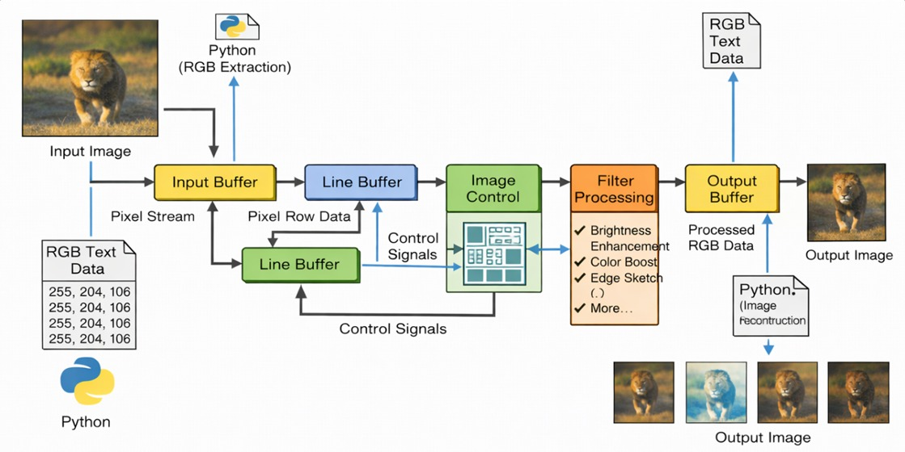
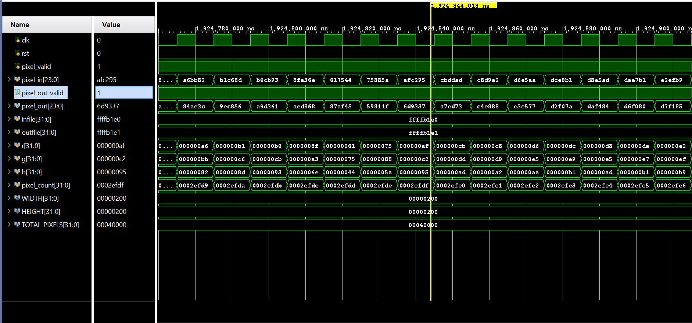

## 📌 Theoretical Background

### 🔹 FPGA-Based Image Processing

Digital image processing on FPGA enables **real-time performance** by exploiting **parallelism and pipelining**.
Unlike CPU-based systems, FPGA processes pixel data in a **streaming manner**, reducing latency and improving throughput.

---

### 🔹 Streaming Architecture

* Pixels are processed **as they arrive**
* No need to store the full image in memory
* Each stage works in parallel → **high throughput (~1 pixel/clock)**

---

### 🔹 Line Buffer & Sliding Window

* Stores previous rows of pixels
* Generates a **3×3 window** for filtering
* Eliminates need for full-frame storage

---

### 🔹 Convolution Operation

G(x,y) = \sum_{i=-1}^{1} \sum_{j=-1}^{1} K(i,j) \cdot I(x+i, y+j)

* Core operation for filters (edge, blur, sharpening)
* Implemented using **parallel multipliers and adders**

---

### 🔹 Fixed-Point Computation

* Avoids floating-point complexity
* Reduces hardware usage
* Maintains sufficient accuracy

---

## 🏗️ System Architecture

<p align="center">
  
</p>

**Figure:** FPGA-based streaming image processing architecture.

### 🔍 Understanding

The system follows a **streaming dataflow architecture**, where pixel data is processed continuously without storing the full image.

* Input pixels are fed sequentially from memory
* Control logic manages synchronization and data validity
* Line buffers store previous rows to generate neighborhood pixels
* Filter module performs real-time computation
* Output buffer streams processed pixels

👉 This design ensures **low latency and high throughput**, ideal for real-time applications.

---

## ⚙️ Processing Pipeline Flow

```text id="m9x3p6"
Input Image 
   → Python (RGB Conversion) 
   → Input Buffer 
   → Line Buffer (3×3 Window) 
   → Filter Module (Convolution) 
   → Output Buffer 
   → Output Image
```

### 🔍 Understanding

This pipeline divides processing into stages:

* Each stage performs a specific operation
* Multiple stages run **simultaneously (pipelining)**
* After initial delay, output is produced every clock cycle

👉 Achieves **~1 pixel per clock throughput**

---

## 🧠 Line Buffer & Sliding Window

### 🔍 Concept

To apply filters, neighboring pixels are required. Instead of storing the full image:

* Line buffers store **previous rows**
* A **3×3 window** is generated dynamically
* Data shifts with each new pixel

👉 This reduces memory usage and enables **continuous processing**

---

## 📊 Results & Waveform Analysis

<p align="center">
  
</p>

**Figure:** Simulation waveform of pixel processing.

### 🔍 Understanding

The waveform verifies hardware behavior:

* **Input valid signal** shows incoming pixel stream
* **Output valid signal** appears after pipeline delay
* Continuous output confirms correct streaming

👉 Demonstrates **pipeline latency and synchronization**

---

## 🎥 Output Visualization (Demo)

<p align="center">
  
</p>

**Figure:** Real-time visual representation of different filters.

### 🔍 Understanding

* Shows multiple filters applied on same input
* Confirms correctness of processing pipeline
* Demonstrates hardware-level transformations

👉 Provides **visual validation of design**

---

## 🖼️ Input vs Output Comparison

<p align="center">
  <table>
    <tr>
      <td align="center"><b>Input Image</b></td>
      <td align="center"><b>Output Image</b></td>
    </tr>
    <tr>
      <td></td>
      <td></td>
    </tr>
  </table>
</p>

<p align="center">
<b>Figure:</b> Comparison between original and processed image.
</p>

### 🔍 Understanding

* Input image is converted into pixel stream
* Filter modifies pixel intensity or features
* Output image reflects hardware processing

👉 Confirms **functional correctness of filters**

---

## 💡 Skills Demonstrated

* **FPGA Design (Verilog HDL)** – RTL design, modular architecture
* **Digital Image Processing** – Filtering, pixel-level operations
* **Streaming Architecture** – AXI-style pipeline
* **Hardware Optimization** – Line buffers, fixed-point arithmetic
* **Verification** – Waveform analysis and debugging
* **HW-SW Integration** – Python + Verilog workflow

---

## 🔗 Direct Links (Quick Access)

* 📐 Architecture Diagram → [Docs/architecture.png](./Docs/architecture.png)
* 📊 Waveform → [Docs/Waveform_02.jpg](./Docs/Waveform_02.jpg)
* 🎥 Demo → [Results/demo.gif](./Results/demo.gif)
* 🖼️ Input Image → [Results/Filters/input.jpg](./Results/Filters/input.jpg)
* 🎨 Output Images → [Results/Filters](./Results/Filters/)

---

